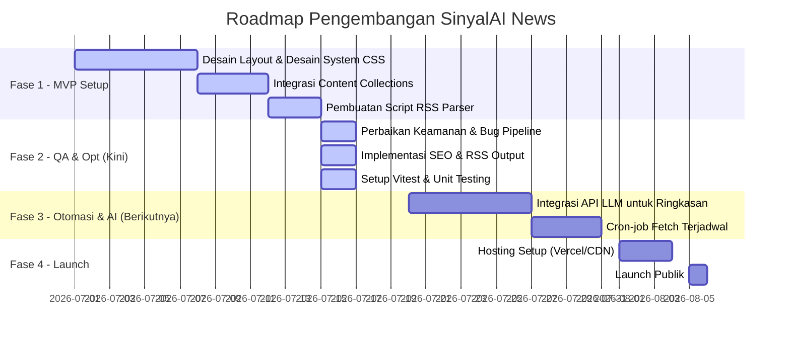

# 📝 Product Requirement Document (PRD) — Sinyal AI

**Nama Proyek:** Sinyal AI (Sinyal Akal Imitasi)  
**Versi Dokumen:** 1.0.0  
**Tanggal:** 15 Juli 2026  
**Status:** Draf Siap Review  
**Tujuan Dokumen:** Menetapkan spesifikasi fungsional, non-fungsional, arsitektur, dan roadmap untuk pengembangan portal berita SinyalAI.

---

## 1. Pendahuluan & Visi Produk

### 1.1 Latar Belakang
Industri kecerdasan buatan (AI) berkembang sangat pesat dengan rilis produk, publikasi riset, dan pembaruan API yang diterbitkan hampir setiap hari oleh para pelaku industri (OpenAI, Anthropic, Google, NVIDIA, Meta, Microsoft, dll.). 

Namun, media berita teknologi umum sering kali menyajikan berita dengan bias opini, judul sensasional (clickbait), atau kurang mendalam secara teknis. Builder, developer, dan antusias AI membutuhkan satu sumber informasi yang **faktual, ringkas, netral, langsung dari sumber resmi, dan bebas dari "kebisingan" (noise) editorial**.

### 1.2 Visi Produk
Menjadi portal berita terdepan di Indonesia khusus untuk memantau rilis resmi dari industri AI dunia secara real-time. SinyalAI menyaring informasi mentah dari RSS/Newsroom resmi pelaku teknologi, memprosesnya menggunakan kecerdasan buatan untuk merangkum poin-poin penting, dan menerbitkannya dalam bahasa Indonesia yang ringkas, objektif, dan memiliki sitasi langsung ke sumber asli.

---

## 2. Tujuan & Proposisi Nilai Utama

### 2.1 Nilai Utama (Core Value Proposition)
1. **Faktual & Objektif**: Nol opini, nol rumor, nol clickbait. Hanya meringkas apa yang secara resmi diumumkan oleh perusahaan pemilik teknologi.
2. **Efisien**: Format ringkasan padat sehingga pembaca bisa menangkap esensi rilis teknologi dalam waktu kurang dari 1 menit.
3. **Terstruktur**: Setiap artikel memiliki atribut yang jelas: Perusahaan, Tanggal Rilis, dan Tautan ke Sumber Resmi.
4. **Builder-Friendly**: Fokus pada dampak teknis (API, model weights, hardware spec, library update) yang relevan untuk developer.

### 2.2 Target Pengguna (Audience Personas)
- **AI Developers / Software Engineers**: Builder yang ingin mengetahui pembaruan API, model baru, dan penurunan harga token secara instan.
- **Product Managers / Tech Leads**: Pengambil keputusan yang memantau kapabilitas model terbaru untuk diintegrasikan ke produk mereka.
- **Tech Enthusiasts / Researchers**: Akademisi atau peminat yang ingin mengikuti tren riset AI (misalnya dari Google DeepMind) tanpa bias media mainstream.

---

## 3. Arsitektur Sistem & Aliran Data

SinyalAI dirancang menggunakan pendekatan hybrid: **Automated Pipeline** untuk pengumpulan data dan **Jamstack/SSG (Static Site Generation)** untuk penyajian web yang sangat cepat dan aman.

```text
+-------------------+      +-------------------------+      +-------------------------+
|  Official RSS     | ---> |  Fetch & Parse Script   | ---> |  Markdown News Drafts   |
|  (OpenAI, etc.)   |      |  (fetch-signals.mjs)    |      |  (src/content/news/)    |
+-------------------+      +-------------------------+      +-------------------------+
                                                                         |
                                                                         v
+-------------------+      +-------------------------+      +-------------------------+
|   Vercel / CDN    | <--- |   Static Build (Astro)  | <--- |  Review & Publish       |
|  (Static Portal)  |      |   (npm run build)       |      |  (draft: false)         |
+-------------------+      +-------------------------+      +-------------------------+
```

---

## 4. Spesifikasi Fungsional (Feature Requirements)

### 4.1 Modul Pengambil Sinyal (RSS Feed Pipeline)
Modul ini bertugas mengambil data secara berkala dari RSS feed resmi produsen teknologi AI.

- **FR-1.1 (Multi-Source Fetching)**: Sistem harus mampu memantau banyak sumber RSS secara paralel yang dikonfigurasi melalui berkas JSON.
- **FR-1.2 (Atomic & RSS Parsing)**: Parser harus mendukung struktur XML RSS 2.0 dan Atom XML secara native dengan toleransi CDATA section.
- **FR-1.3 (Duplicate Detection)**: Sistem harus mencegah duplikasi pengambilan dengan membandingkan slug artikel baru terhadap daftar artikel yang sudah ada di direktori konten.
- **FR-1.4 (CLI Controls)**: Developer harus dapat menjalankan pipeline dengan opsi filter `--source [id]`, pembatasan item `--limit [N]`, dan simulasi `--dry-run`.
- **FR-1.5 (Rate Limiting & Safety)**: Proses fetch antar server harus diberi jeda (minimal 500ms) untuk mencegah rate-limit block, serta membatasi ukuran respons (max 5MB) untuk menghindari memori meluap.

### 4.2 Pemrosesan Konten (AI Processing Engine - Roadmap)
Modul untuk mentranslasikan dan merangkum konten berita mentah menjadi ringkasan bahasa Indonesia yang terstruktur.

- **FR-2.1 (LLM Integration)**: Pipeline harus terhubung ke API LLM (misalnya Grok API, Gemini API, atau OpenAI API) untuk memproses teks mentah RSS `<description>` atau konten penuh halaman sumber.
- **FR-2.2 (Stuctured Summarization)**: Ringkasan AI harus mematuhi format template bahasa Indonesia yang objektif:
  - **Judul**: Ringkas, deklaratif, menyebutkan subjek dan aksi.
  - **Ringkasan (1-2 kalimat)**: Highlight esensi pengumuman.
  - **Yang Baru (Bullet points)**: Poin-poin fitur baru atau pembaruan teknis.
  - **Dampak (Bullet points)**: Konsekuensi teknis/ekonomis dari pembaruan ini.
- **FR-2.3 (Translation Quality)**: Istilah teknis (seperti *weight, fine-tuning, inference*) harus disesuaikan dengan konteks developer Indonesia, baik dipertahankan dalam bahasa Inggris atau diterjemahkan secara lazim.

### 4.3 Alur Kerja Editorial (Editorial Workflow & CMS)
Sistem harus menggunakan file-based CMS berbasis Git.

- **FR-3.1 (Drafting Mode)**: Setiap sinyal yang baru diambil dari RSS otomatis ditulis dengan status `draft: true` dalam bentuk file Markdown.
- **FR-3.2 (Metadata Verification)**: Frontmatter Markdown harus berisi parameter wajib:
  ```yaml
  title: string
  summary: string
  company: string
  source: string (HTTPS URL)
  publishedAt: YYYY-MM-DD
  draft: boolean
  ```
- **FR-3.3 (Manual Review)**: Editor (manusia) melakukan review konten draf, melakukan perbaikan editorial, dan mengubah status menjadi `draft: false`.
- **FR-3.4 (Automated Build Trigger)**: Saat draf yang diubah di-commit ke repositori utama, hosting platform (misal Vercel) memicu build otomatis untuk memperbarui situs web publik.

### 4.4 Portal Web (Static Web Portal)
Portal front-end yang menyajikan berita secara instan dan responsif.

- **FR-4.1 (Clean Tech Aesthetics)**: Antarmuka harus mengadopsi tema gelap premium (*dark mode tech polish*) dengan skema warna HSL yang terpadu (latar gelap `#07090c`, aksen hijau neon/cyan `#3dff9a`, teks kontras tinggi).
- **FR-4.2 (Homepage Feed)**: Halaman beranda menampilkan hero section, daftar chip perusahaan yang aktif di dalam sistem, dan menampilkan maksimal 3 sinyal terbaru.
- **FR-4.3 (Archived Feed)**: Halaman `/berita` menampilkan seluruh arsip sinyal yang diurutkan berdasarkan tanggal publikasi terbaru secara menurun.
- **FR-4.4 (Responsive Layout)**: Situs web harus ramah seluler (*mobile-friendly*) dan beradaptasi secara mulus pada berbagai ukuran layar (desktop, tablet, mobile).
- **FR-4.5 (Dynamic Detail Page)**: Halaman `/berita/[slug]` merender konten Markdown secara utuh dengan styling tipografi yang rapi menggunakan modul `.prose`.

### 4.5 Distribusi & SEO (SEO & RSS Distribution)
Memastikan konten mudah ditemukan oleh mesin pencari dan dapat didistribusikan ke agregator eksternal.

- **FR-5.1 (Metadata SEO)**: Setiap halaman wajib menyertakan deskripsi unik, title tag dinamis, canonical URL, dan meta tags sosial (Open Graph & Twitter Cards).
- **FR-5.2 (Sitemap & Sitemap Index)**: Sistem otomatis memproduksi sitemap XML setiap kali build dijalankan untuk mengindeks seluruh halaman berita aktif.
- **FR-5.3 (Robots.txt)**: Menyediakan file `robots.txt` publik untuk memandu Googlebot dan crawler web lainnya.
- **FR-5.4 (Structured Data JSON-LD)**: Setiap halaman artikel berita harus menyematkan skema data terstruktur `NewsArticle` untuk mendukung Google News dan Rich Snippets.
- **FR-5.5 (RSS Feed Output)**: Menyediakan endpoint `/rss.xml` yang dapat di-subscribe oleh pembaca menggunakan RSS reader eksternal.

---

## 5. Persyaratan Non-Fungsional (Non-Functional Requirements)

### 5.1 Performa (Performance)
- **NFR-1.1 (Static Generation)**: Semua halaman utama harus statis (SSG). Nol pemrosesan database saat runtime user request.
- **NFR-1.2 (FCP / LCP)**: Target *First Contentful Paint* (FCP) di bawah 0.8 detik, dan *Largest Contentful Paint* (LCP) di bawah 1.5 detik pada koneksi mobile 4G.
- **NFR-1.3 (Lighthouse Score)**: Target skor Lighthouse minimal 95 untuk Performance, Accessibility, Best Practices, dan SEO.

### 5.2 Keamanan (Security)
- **NFR-2.1 (Input Sanitization)**: Semua string yang dimasukkan ke dalam frontmatter Markdown harus di-escape secara aman untuk menghindari malformasi YAML.
- **NFR-2.2 (Protocol Validation)**: Hanya tautan dengan protokol `https://` yang boleh disimpan sebagai URL artikel dan tautan sitasi guna menghindari serangan XSS (misal `javascript:` injection) atau pembacaan file lokal (SSRF).
- **NFR-2.3 (No Client Scripts)**: Portal berita tidak membutuhkan JavaScript sisi klien untuk merender halaman (Zero-JS by default), meminimalkan risiko eksploitasi keamanan di browser pengguna.

### 5.3 Aksesibilitas (Accessibility)
- **NFR-3.1 (WCAG AA Compliance)**: Rasio kontras teks (terutama warna mute gray pada latar gelap) minimal harus memenuhi 4.5:1.
- **NFR-3.2 (Keyboard Navigation)**: Navigasi situs harus sepenuhnya dapat diakses via keyboard, dilengkapi skip-link *"Lewati ke konten"*, dan indikator fokus visual `:focus-visible` yang jelas.
- **NFR-3.3 (Screen Reader Compatibility)**: Struktur HTML harus semantik dengan atribut ARIA landmark (`role="list"`, `aria-current="page"`, `aria-label`) pada elemen non-semantik.

---

## 6. Spesifikasi Teknologi (Tech Stack)

### 6.1 Frontend & Site Generator
- **Framework**: Astro 7 (Static Mode)
- **Routing**: File-based dynamic routing
- **Styling**: Vanilla CSS dengan modern design token
- **Content Loading**: Astro Content Collections (glob loader)

### 6.2 Automation Pipeline (Scripts)
- **Runtime**: Node.js >= 22.12.0
- **Format**: ECMAScript Modules (ESM)
- **Dependencies**: `@astrojs/rss` (RSS output), `@astrojs/sitemap` (sitemap generation)
- **XML Parsing**: Regex-based lightweight parser (dengan pengaman ReDoS & OOM)

### 6.3 Penjaminan Mutu & Pengujian (QA & Testing)
- **Framework**: Vitest (Unit Testing)
- **Test Target**: Modul parsing RSS, pembuatan markup, sanitasi YAML, pembuatan slug URL, dan utilitas formatting tanggal.

### 6.4 Rangkuman Arsitektur Teknologi (Tech Stack Summary)

Berikut adalah ringkasan teknologi yang digunakan di seluruh ekosistem SinyalAI:

| Lapisan (Layer) | Teknologi | Versi / Spesifikasi | Peran / Deskripsi |
| :--- | :--- | :--- | :--- |
| **Penyaji Situs (Frontend)** | Astro | `^7.0.7` (Static) | Kerangka kerja Jamstack untuk kompilasi HTML/CSS statis. |
| **Gaya Visual (Styling)** | Vanilla CSS | Desain Kustom | Menggunakan CSS Custom Properties untuk sistem desain adaptif. |
| **Script Otomasi** | Node.js | `>= 22.12.0` (ESM) | Mesin pengambil data RSS dan penulisan draf markdown. |
| **Pengujian (Testing)** | Vitest | `^4.1.10` | Kerangka pengujian cepat untuk validasi logika penunjang. |
| **Ekstensi Astro** | `@astrojs/rss` | `^4.0.0` | Library untuk menyajikan file umpan berita RSS internal. |
| **Peta Situs (SEO)** | `@astrojs/sitemap` | `^3.0.0` | Library pembuat sitemap XML otomatis saat kompilasi. |
| **Skema Validasi** | Zod | Integrasi Astro | Melakukan verifikasi tipe data dan protokol HTTPS di frontmatter. |
| **Hosting & CDN** | Vercel | Jamstack (Roadmap) | Serverless host untuk meluncurkan portal berita statis. |

---

## 7. Roadmap Pengembangan & Rilis



### 7.1 Fase 1: MVP Setup (Selesai)
Fokus pada pembuatan kerangka Astro, layout dasar, styling dark-mode, content collection artikel contoh, dan struktur parser RSS paling awal.

### 7.2 Fase 2: QA & Optimasi (Selesai - Rilis Saat Ini)
Fokus pada audit kualitas kode, penanganan celah keamanan, mitigasi serangan OOM/ReDoS di parser, integrasi Sitemap & RSS, penerapan structured data JSON-LD, pembuatan unit test otomatis (Vitest), dan verifikasi build produksi 100% hijau.

### 7.3 Fase 3: Otomasi AI & Scheduler (Roadmap)
Mengintegrasikan modul penulisan ringkasan otomatis menggunakan API LLM (xAI Grok / Gemini API / OpenAI API). Menyetel cron-job terjadwal (misal menggunakan GitHub Actions) untuk menjalankan pipeline fetch RSS dan menulis draf Markdown secara otomatis setiap 6 jam.

### 7.4 Fase 4: Launching (Roadmap)
Melakukan deploy repositori ke Vercel atau Cloudflare Pages, mengonfigurasi custom domain, mendaftarkan sitemap ke Google Search Console, dan meluncurkan feed publik secara luas.
